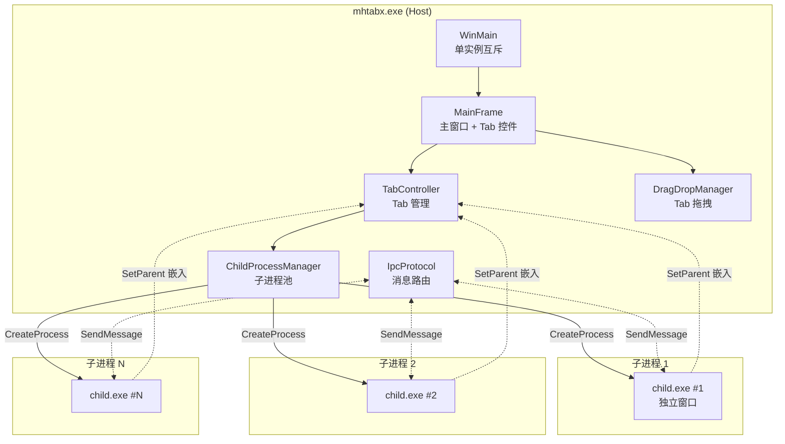

# mhtabx 架构设计

## 总览

mhtabx 由两个角色组成：

- **mhtabx.exe**（主进程）：单实例、管理 Tab 控件、启动子进程、IPC 消息路由
- **child**（多个子进程）：独立进程，主窗口被 `SetParent` 嵌入 Tab 页



## 分层设计

### Layer 1: 入口层 (WinMain)

职责：
- 解析命令行
- 计算工作目录指纹（MD5 hex）作为窗口类名后缀
- 单实例互斥锁：`Global\mhtabx_{MD5}`
- 若已有实例：`FindWindow` + `SendMessage(WM_COPYDATA)` 转发命令行后退出
- 否则：初始化 MainFrame，进入消息循环

### Layer 2: UI 层 (MainFrame / TabController / SkinRenderer)

- **MainFrame**：注册窗口类、创建主窗口、`WndProc` 调度
- **TabController**：封装 `SysTabControl32`，管理 `ViewSlot` 数组
- **SkinRenderer**：自绘 Tab 头部（W4 再实现）

### Layer 3: 进程管理层 (ChildProcessManager)

- `ChildInfo` 结构：`hProcess`、`pid`、`hwnd`、`state`、`slot_index`
- `std::vector<ChildInfo>` 池子
- 后台线程用 `WaitForMultipleObjects` 等待任意子进程退出
- 退出后：
  - `state == Closing` → 正常清理
  - 否则 → 尝试 reload（拉起新实例替换）

### Layer 4: IPC 层 (IpcProtocol)

定义 13 种自定义消息（参考原 mhtab 但不保持二进制兼容）：

```cpp
enum MhxMsg : UINT {
    MHX_NEW_CLIENT       = WM_APP + 1,    // 子进程注册
    MHX_READY_CONFIRM    = WM_APP + 3,    // 子进程就绪确认
    MHX_FORWARD_INPUT    = WM_APP + 4,    // 键鼠转发
    MHX_UPDATE_POS       = WM_APP + 6,    // 位置同步
    MHX_ACTIVATE_VIEW    = WM_APP + 7,    // 激活 Tab
    MHX_HIDE_VIEW        = WM_APP + 8,    // 隐藏所有 Tab
    MHX_NEW_VIEW         = WM_APP + 16,   // 请求新建
    MHX_GET_BY_PARENT    = WM_APP + 17,   // 按父窗口查 view
    MHX_CLEANUP_VIEW     = WM_APP + 25,   // 清理 view
    MHX_SHOW_WINDOW      = WM_APP + 26,   // ShowWindow 转发
    MHX_ACTIVATE         = WM_APP + 4102, // 激活 + focus
    MHX_BRING_TO_FRONT   = WM_APP + 4103, // 强制置顶（AttachThreadInput）
    MHX_FIND_BY_HWND     = WM_APP + 4104, // 按 HWND 查找
    MHX_HEARTBEAT        = WM_APP + 0x1304, // 心跳检测子进程存活
};
```

### Layer 5: 拖拽层 (DragDropManager)

- 监听 Tab 控件的 `WM_LBUTTONDOWN` + `WM_MOUSEMOVE`
- `DragDetect` 确认是拖拽而非点击
- 拖拽中：`GetCursorPos` + `WindowFromPoint` 找目标
- 落点判断：
  - 同一主框架内 → 重排 Tab
  - 落到别的 mhtabx 窗口 → 跨框架转移（`SendMessage` + 目标端 `SetParent`）
  - 落到空白区域 → 创建新主框架并转移

## 核心数据结构

```cpp
// Tab 槽位（对应原 mhtab 的 ViewSlot）
struct ChildSlot {
    int          slot_id;       // 在 TabController 中的索引
    HANDLE       hProcess;      // 子进程句柄
    DWORD        pid;
    HWND         child_hwnd;    // 子进程主窗口
    HWND         tab_page;      // 在 Tab 控件中的对应 page
    ChildState   state;         // Starting/Running/Closing/Dead
    std::wstring title;         // 显示标题
    std::wstring cmdline;       // 启动参数（reload 用）
};

enum class ChildState {
    Starting,   // 已 CreateProcess，等待 NEW_CLIENT 注册
    Running,    // 注册完成，可交互
    Closing,    // 收到关闭请求，等待 WaitForSingleObject
    Dead,       // 子进程已退出
};
```

## 关键设计决策

### 1. 为什么用 `SetParent` 而不是 DX/GDI 拷屏？

`SetParent` 是 Win32 官方支持的跨进程窗口嵌入，零拷贝、原生交互。缺点是子进程的消息循环仍独立运行，输入焦点需要显式转发（`MHX_FORWARD_INPUT`）。

### 2. 为什么每个子进程独立进程而非多线程？

- **隔离**：一个子进程 crash 不影响其他 Tab
- **绕过单例**：很多游戏/应用有"同进程单例"检查，多进程才能多开
- **稳定**：Windows 进程调度比线程更稳定

### 3. 为什么用 `WaitForMultipleObjects` 而非后台线程？

原 mhtab 在主消息循环每次迭代 `WaitForMultipleObjects(..., timeout=0)` 探测退出，避免引入后台线程的同步复杂度。mhtabx 沿用此设计。

### 4. 为什么单独的 `demo_child.exe`？

用于**集成测试**：验证 mhtabx 能正确嵌入、关闭、重启子进程，不依赖特定外部程序（梦幻西游）。

## 异常处理策略

| 场景 | 策略 |
|---|---|
| 子进程 `CreateProcess` 失败 | `MessageBox` 提示 + 保留 slot 空闲状态 |
| 子进程启动后 10 秒未发 `NEW_CLIENT` | 标记为 Dead，TerminateProcess |
| 子进程心跳无响应 | 尝试 reload，3 次失败后 View_ForceClose |
| 最后一个子进程关闭 | PostQuitMessage(0) + exit(0) |
| 单实例互斥锁创建失败 | 不做转发，直接退出（说明权限问题） |

## 与原 mhtab 的接口差异

### 不兼容项

- 命令行格式：原 `my.exe <prefix> <fmt><slot> <div> <mod> <pid> <workdir_id> <pad08d>` 改为 `--slot N --parent HWND --extra "..."`
- 互斥锁名：原 `MHXYWinMgr{MD5}` 改为 `Global\mhtabx_{MD5}`
- 消息号：保持相对编号但基于 `WM_APP` 而非原 `0x0001`

### 迁移指南

如果需要 binary 兼容原 my.exe 协议，可在 `IpcProtocol.h` 中定义：

```cpp
#define MHXY_COMPAT_MODE  1  // 开启后使用原消息号
```

但默认不启用，避免未来协议演进时受历史约束。
