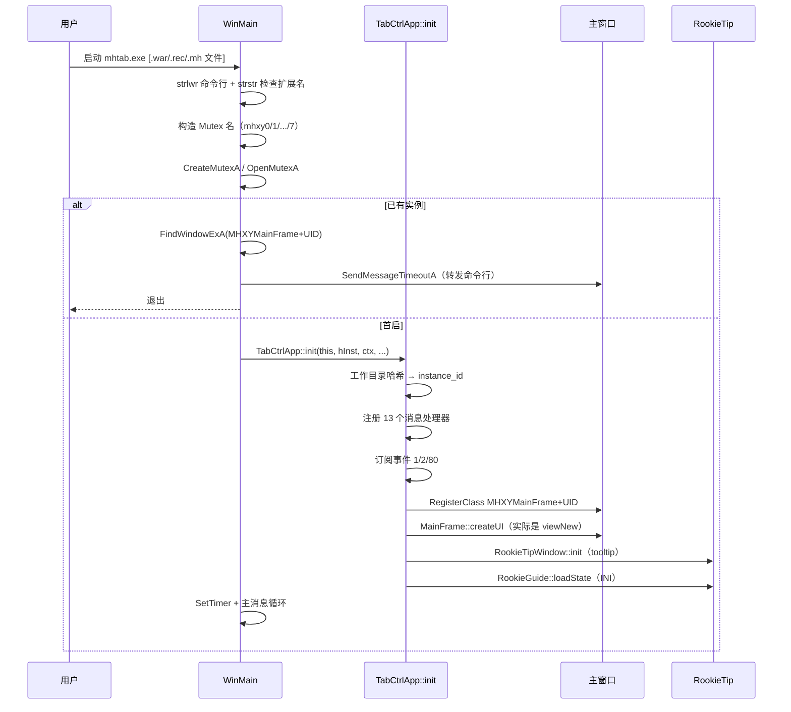
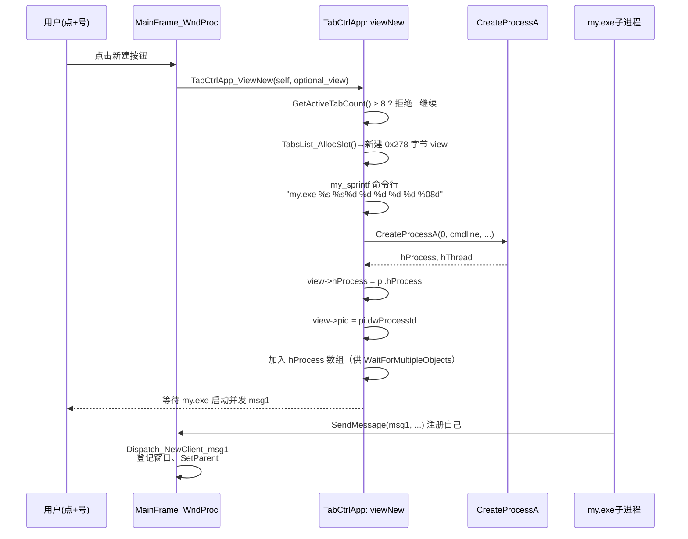

# DESIGN — mhtab.exe 架构还原

## 1. 程序定位

`mhtab.exe` 是 **梦幻西游(MHXY) 多开 Tab 管理器**：把多个独立的游戏进程（命名为 `my.exe`）作为子进程拉起，将它们的窗口"收编"到主框架的 Tab 控件下，类似浏览器多标签页。

## 2. 顶层架构图

```mermaid
flowchart TD
    subgraph 主进程 mhtab.exe
        Main[WinMain<br/>0x140017340]
        Mutex[创建命名互斥锁<br/>检查命令行扩展名 .war/.rec/.mh]
        FW[FindWindowExA<br/>查找已有 MHXYMainFrame_UID]
        Init[TabCtrlApp::init<br/>0x140014E50]
        ML[消息循环<br/>GetMessage / Translate / Dispatch]
        WP[MainFrame_WndProc<br/>0x14000AFF0<br/>4041字节, 216 case]
        WC[TabCtrlApp::waitforCmd<br/>0x140016BE0<br/>WaitForMultipleObjects]
    end

    subgraph 子进程数组 my.exe[1..8]
        C1[my.exe #1<br/>梦幻西游实例 1]
        C2[my.exe #2<br/>梦幻西游实例 2]
        CN[my.exe #N<br/>...最多 8 个]
    end

    Main --> Mutex
    Mutex -- 已存在实例 --> FW
    FW -- 找到主窗口 --> SendCmd[转发命令行<br/>SendMessageTimeoutA]
    Mutex -- 首启 --> Init
    Init --> RegMsg[注册 13 个消息处理器]
    Init --> RegClass[注册主窗口类<br/>MHXYMainFrame+UID]
    Init --> CW[创建主窗口]
    Init --> RT[RookieTipWindow::init]
    CW --> ML
    ML --> WP
    WP --> WC
    WC -. 子进程退出事件 .-> C1
    WC -. .-> C2
    WC -. .-> CN
    WP -- viewNew --> CP[CreateProcessA<br/>启动 my.exe]
    CP --> C1
    CP --> C2
    CP --> CN
```

## 3. 主体类与数据结构

### 3.1 单例对象（线程安全 std::once_flag 风格）

| 名称 | 全局变量 | Getter | 大小 | 职责 |
|---|---|---|---|---|
| `TabCtrlApp` | `g_TabCtrlApp_instance` (`0x14004FE38`) | `TabCtrlApp_GetInstance` (`0x1400087F0`) | 0x60 | 应用入口，事件订阅链表 |
| `MainFrame`  | `g_MainFrame_instance`  (`0x14004FEB0`) | `MainFrameSingleton_GetInstance` (`0x1400088C0`) | ≥0x440 | 主窗口对象（this 指针） |
| `TabsList`   | `g_TabsList`            (`0x1400519B0`) | `TabsList_GetInstance` (`0x140018460`) | 16 字节（vector 头） | view slot vector |

### 3.2 view slot 结构（0x278 字节）— `TabsList_AllocSlot` 中初始化

| 偏移 | 类型 | 含义 |
|---|---|---|
| +0 | int | view_id（-1=空闲） |
| +8 | ptr  | view container（指向 0xB50 字节的 `MainFrame::ViewContainer`） |
| +16 | HWND | 容器 HWND |
| +24 | int  | tab_index（-1=未分配） |
| +28 | int  | tab_id |
| +32 | byte | 鼠标按下标志 |
| +260..272 | int×3 | 鼠标坐标快照 |
| +288 | obj  | 定时器对象（30 秒粒度桶） |
| +336 | HWND | 子进程游戏主窗口 |
| +344 | HANDLE | 子进程 hProcess |
| +352 | int  | 编号 |
| +356 | byte | **active 标志（核心）** |
| +600 | byte | ready 标志 |
| +613 | byte | OnReadyConfirm 标志 |
| +616 | int  | 状态机（1=closing, 4=cleanup） |
| +620 | int  | 30s 桶值（`Calc_30s_Bucket`） |
| +624 | DWORD | 子进程 PID |

### 3.3 MainFrame 对象（this，指向单例）

| 偏移 | 类型 | 含义 |
|---|---|---|
| +8..+1031 | char[1024] | 缓冲区（构造时清零） |
| +1032 | ptr | view container vector 起始 |
| +1040 | ptr | view container vector 结束 |
| +1048 | ptr | view container vector 容量 |
| +1056 | int | last view index |
| +1060 | int | total view count（==0 时退出程序） |
| +1064..+1080 | xmm | 工作目录上下文/初始化参数 |
| +1088 | HINSTANCE | hInstance |
| +1096 | byte | global ready flag |
| +1148 (idx 287) | int | 配置加载完成标志 |
| +1984 | vtbl | 子对象 vtable（poll 钩子等） |

### 3.4 Tab 类名构造

为防多目录冲突，类名后缀是当前目录的 MD5 hex：

```c
"MHXYMainFrame" + MD5_HEX(GetCurrentDirectoryA())  // 主窗口类
"MHXYWinMgr"    + MD5_HEX(GetCurrentDirectoryA())  // 子窗口类
```

实现：`GetUniqueIdSuffix` (`0x1400146C0`) 用 ADVAPI32 `CryptCreateHash(CALG_MD5)` 计算。

## 4. 消息分发系统

### 4.1 双消息总线

主程序内部有两套消息：

**A. Win32 自定义消息（窗口消息）**：13 个消息号 → 函数注册到 `MainFrame_RegisterMsgHandler` (`0x140018A30`)

| msg | 处理函数 | 功能 |
|---|---|---|
| 1 | `Dispatch_NewClient_msg1` | 子进程注册（`my.exe` 启动后回报） |
| 3 | `Dispatch_OnReadyConfirm_msg3` | 客户端就绪确认 |
| 4 | `MainFrame_OnMsg4_ForwardInput` | 转发键鼠输入到子窗口 |
| 6 | `Dispatch_UpdatePos_msg6` | 子窗口位置/大小更新 |
| 7 | `Dispatch_ActivateView_msg7` | 激活某 view（不抢前台） |
| 8 | `Dispatch_HideView_msg8` | 隐藏 view |
| 16 | `MainFrame_OnMsg16_NewView` | 请求新建 view |
| 17 | `Dispatch_GetByParentHwnd_msg17` | 通过父窗口查 view |
| 25 | `Dispatch_CleanupView_msg25` | 视图定时清理 |
| 26 | `Dispatch_ShowWindow_msg26` | 改 ShowCmd |
| 4102 (0x1006) | `Dispatch_Activate_msg4102` | 激活并 focus |
| 4103 (0x1007) | `Dispatch_BringToFront_msg4103` | **强制拉至最前（AttachThreadInput 技巧）** |
| 4104 (0x1008) | `Dispatch_FindByHwnd_msg4104` | 通过 HWND 查找/激活 view |

**B. 应用事件总线（`TabCtrlApp_AddListener`）**：观察者模式订阅链表

| event | 监听器 | 功能 |
|---|---|---|
| 1 | `TabCtrlApp_OnEvent1_InitTabList` | Tab 列表初始化 |
| 2 | `TabCtrlApp_OnEvent2_TimerPoll` | 定时轮询（每个 active view 调 PollTick） |
| 80 | `TabCtrlApp_OnEvent80_OnReady` | 主窗口就绪后初始化大对象 |

### 4.2 子进程通信协议

```
my.exe 子进程 ──msg1(NewClient)──▶ 主进程
                                  ├─ 登记窗口句柄到 TabsList
                                  ├─ View_Activate（设置位置/层级）
                                  └─ 等待 OnReadyConfirm

my.exe ──msg3(Ready)──▶ 主进程 ──msg4(转发输入)──▶ my.exe
my.exe ──msg6(位置)──▶ 主进程
                       ▲
                       └ msg4103(强制 BringToFront)
```

## 5. 关键流程

### 5.1 启动流程



### 5.2 创建新 Tab（拉起子进程）



### 5.3 子进程退出处理

```mermaid
flowchart LR
    WaitForMultipleObjects --> 检测某子进程退出
    检测某子进程退出 --> TabsList_FindByProcHandle
    TabsList_FindByProcHandle --> View_RemoveTab
    View_RemoveTab --> 移除Tab控件项
    移除Tab控件项 --> Sub_OnViewLost
    Sub_OnViewLost --> CloseHandle
    CloseHandle --> TabsList_FreeSlot
    TabsList_FreeSlot --> 数组左移
    数组左移 --> TryReloadView
    TryReloadView -- 失败 --> View_Deactivate
    View_Deactivate --> 检查剩余 view 数==0
    检查剩余 view 数==0 -- 是 --> PostQuitMessage_exit
```

## 6. 反多开/防冲突机制

| 机制 | 实现 |
|---|---|
| **同目录单实例** | 主窗口类名带 `MD5(workdir)` 后缀 + `FindWindowExA` |
| **跨进程唯一性** | 命名互斥锁 `mhxy0`~`mhxy7` |
| **8 实例上限** | `GetActiveTabCount` 检查 mutex 数量 |
| **强制拉前台绕过** | `AttachThreadInput` + `SetForegroundWindow` |
| **防频繁切换** | `Dispatch_BringToFront_msg4103` 用 `_time64`/`difftime64` 检查 ≥1秒 |

## 7. 配置存储

- 路径：`{当前目录}\xxx.ini`（路径在 `g_workdir_buf`，由 `get_ini` 拼接）
- 读：`get_ini(out_str, workdir, section, key, default_str)` → 包装 `GetPrivateProfileStringA`
- 写：`WritePrivateProfileStringA`
- 数值：用 `my_sscanf` 解析返回字符串

## 8. UI 组件

| 组件 | 类 | 实现 |
|---|---|---|
| 主框架 | `MHXYMainFrame` | `MainFrame_WndProc` (216 case dispatch) |
| Tab 头 | `TabBarPlus` | `TabBarPlus_doDragging` 含拖拽重排 |
| 新手提示 | `RookieTipWindow` | `tooltips_class32` 子类化 |
| 皮肤绘制 | `Skin_DrawBitmapEx` | `BitBlt`/`StretchBlt`/`AlphaBlend`/`TransparentBlt` |

## 9. 已识别字符串证据

| 字符串 | 函数 | 关键性 |
|---|---|---|
| "MHXYMainFrame" | 主窗口类名 | 高 |
| "MHXYWinMgr"    | 子窗口类名 | 高 |
| "Dispacth::newClient : ..." | `Dispatch_NewClient_msg1` | 高（确认 Dispatch 类） |
| "TabCtrlApp::viewNew : start my.exe, ARG_LEN = %d; arg = %s" | `TabCtrlApp_ViewNew` | 高（确认 TabCtrlApp 类 + my.exe 子进程） |
| "TabCtrlApp::waitforCmd START and receive an event" | `TabCtrlApp_WaitForCmd` | 高 |
| "RookieGuide::loadState" | `RookieGuide_loadState` | 中 |
| "RookieTipWindow::init" | `RookieTipWindow_Init` | 中 |
| "TabBarPlus::doDragging" | `TabBarPlus_doDragging` | 中 |
| "WM_SYSCOMMAND SC_CLOSE..." | `MainFrame_WndProc` | 中 |
| "get_ini, file = %s, session = %s..." | `get_ini` | 中 |
| "mhxy%d" | `GetActiveTabCount` | 高（实例上限 8） |

## 10. 风险与未覆盖项

- 主 WndProc (`MainFrame_WndProc`, 216 case) **未对单个 case 详细分析**，仅识别整体职责。后续如需，可针对具体 WM_ID 单独跟进。
- `RookieTipWindow_NewWndProc` (`0x14000E950`) 中的子类化处理逻辑未深挖。
- 仅命名了大约 50 个核心函数；剩余约 480 个未命名函数多为 STL/CRT 内部、绘图细节、链表算法。
